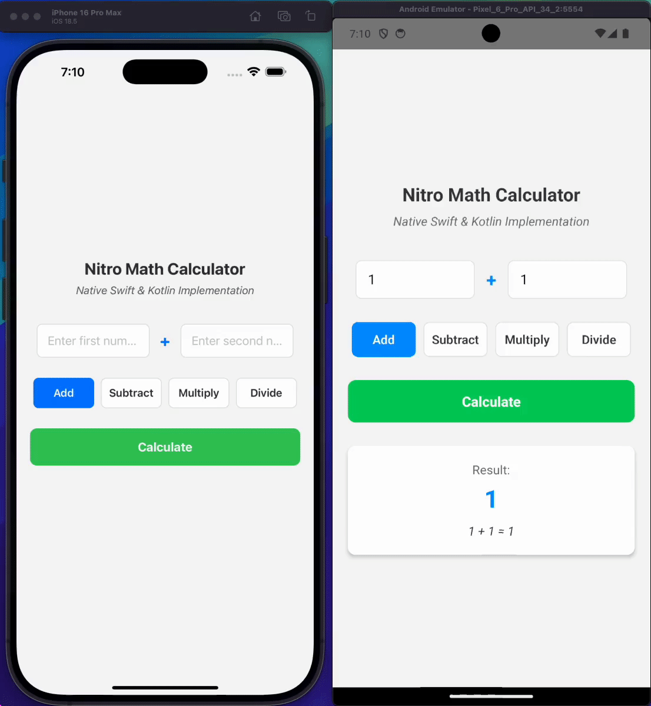

# NitroExample
> RN CLI App with local nitro module (as subpackages)

> 📖 **Official Guide**: [using Nitro in your app via a subpackage](https://nitro.margelo.com/docs/using-nitro-in-your-app)

> Prefer reading code? Skip this README and check out [the code changes](https://github.com/ramirezjag00/nitroexample/pull/1)

A React Native project demonstrating the in-app integration of [Nitro Modules](https://github.com/mrousavy/nitro) with both iOS and Android platforms. This project shows how to create hybrid objects that can perform basic calculations from the native side, and showcases a structure.

## 📹 Demo



> **⚠️ Important**: The React Native project is named "NitroExample", which should not be confused with the iOS and Android Nitro module also named "NitroExample" (see nitro.json). The project name and the Nitro module name happen to be the same in this example, but they serve different purposes:
> - **Project name**: The React Native app container
> - **Nitro module name**: The native library that provides the math functionality

## 🚀 Project Overview

This project implements a `MathCalculator` Nitro module that provides basic arithmetic operations (add, subtract, multiply, divide) using native iOS (Swift) and Android (Kotlin) implementations, bridged through Nitro's C++ core.

## 📁 Project Structure

```
NitroExample/
├── 📱 App.tsx                           # Main React Native app
├── 🔧 nitro.json                       # Nitro configuration
├── 📝 nitrospecs/                      # TypeScript Nitro specifications
│   └── MathCalculator.nitro.ts
├── 🧬 nitrogen/generated/              # Auto-generated by nitrogen
│   ├── shared/c++/                     # Cross-platform C++ specs
│   ├── ios/                            # iOS-specific generated files
│   │   ├── HybridMathCalculator.swift  # 🍎 iOS implementation
│   │   ├── NitroExample+autolinking.rb # iOS autolinking helper
│   │   └── ...                         # Other generated iOS files
│   └── android/                        # Android-specific generated files
│       ├── NitroExample+autolinking.gradle # Android autolinking helper
│       ├── NitroExample+autolinking.cmake  # Android CMake autolinking
│       └── ...                         # Other generated Android files
├── 🍎 NitroExample.podspec             # iOS package definition (root)
├── 🤖 nitro-example/                   # Android Nitro module
│   ├── build.gradle                    # Android library configuration
│   ├── CMakeLists.txt                  # Android CMake setup
│   └── src/main/                       # Android source code
│       ├── AndroidManifest.xml
│       ├── cpp/cpp-adapter.cpp         # JNI bridge
│       └── java/com/margelo/nitro/example/
│           ├── HybridMathCalculator.kt # 🤖 Android implementation
│           └── NitroExamplePackage.kt  # React Native package
├── 🍎 ios/                             # iOS React Native app
│   ├── Podfile                         # CocoaPods dependencies
│   └── ...
└── 🤖 android/                         # Android React Native app
    ├── settings.gradle                 # Includes nitro-example module
    └── ...
```

## 🛠️ Setup Instructions

### Prerequisites

1. React Native development environment
2. Install Nitro Modules: `yarn add react-native-nitro-modules`
3. Install Nitrogen codegen: `yarn add nitro-codegen --dev`

### Creating nitro config
1. **Create nitro config** in `nitro.json`
```json
{
  "$schema": "https://nitro.margelo.com/nitro.schema.json",
  "cxxNamespace": ["example"],
  "ios": {
    "iosModuleName": "NitroExample"
  },
  "android": {
    "androidNamespace": ["example"],
    "androidCxxLibName": "NitroExample"
  },
}
```

### Creating a nitro spec and using nitrogen
> see nitrospecs/MathCalculator.nitro.ts

> see nitro.json

When adding new Nitro specs:

1. **Create spec** in `nitrospecs/YourSpec.nitro.ts`
2. **Run codegen**: `npx nitro-codegen`
3. **Implement in platforms**:
   > see `Creating subpackages` section
   - iOS: Create implementation in `nitrogen/generated/ios/HybridMathCalculator.swift`
   - Android: Create implementation in `nitro-example/src/main/java/.../HybridMathCalculator.kt`
   - Android: Create React Native package in `nitro-example/src/main/java/.../NitroExamplePackage.kt`
4. **Register in `nitro.json`**:
```json
{
  "autolinking": {
    "YourSpec": {
      "swift": "HybridYourSpec",
      "kotlin": "HybridYourSpec"
    }
  }
}
```

### Creating subpackages
#### iOS Setup

For iOS, the setup uses **autolinking** via CocoaPods:

1. **Create the podspec in project root** (`NitroExample.podspec`):
```ruby
Pod::Spec.new do |s|
  s.name         = 'NitroExample'
  s.version      = '1.0.0'
  s.summary      = 'Native Math Implementation'
  # ... other podspec config

  # 🔥 Use Nitrogen's autolinking
  load 'nitrogen/generated/ios/NitroExample+autolinking.rb'
  add_nitrogen_files(s)
end
```

2. **Create iOS implementation** in `nitrogen/generated/ios/HybridMathCalculator.swift`

3. **Add to Podfile** in `ios/Podfile`:
```ruby
target 'NitroExample' do
  pod 'NitroExample', :path => '../'
  # ... other dependencies
end
```

4. **Install pods**: `yarn pods`

#### Android Setup  

For Android, the setup uses **Nitrogen's autolinking** via the local Android module:

1. **Create local Android library** in `nitro-example/` directory
   - This contains `build.gradle`, `CMakeLists.txt`, and `src/` with Android implementations

2. **Autolinking in build.gradle**:
```gradle
// Use Nitrogen's generated autolinking
apply from: '../nitrogen/generated/android/NitroExample+autolinking.gradle'

android {
  namespace "com.margelo.nitro.example"
  // ... rest of configuration
}
```

3. **Autolinking in CMakeLists.txt**:
```cmake
# Use Nitrogen's generated autolinking
include(${CMAKE_SOURCE_DIR}/../nitrogen/generated/android/NitroExample+autolinking.cmake)

# Create library with your custom sources
add_library(
  ${PACKAGE_NAME}
  SHARED
  src/main/cpp/cpp-adapter.cpp
)
```

4. **Include in main app** (`android/settings.gradle`):
```gradle
include ':nitro-example'
project(':nitro-example').projectDir = new File(rootProject.projectDir, '../nitro-example')
```

5. **Add dependency** (`android/app/build.gradle`):
```gradle
dependencies {
  implementation project(':nitro-example')
}
```

6. **Create Android implementations**:
   - **Kotlin implementation** (`nitro-example/src/main/java/.../HybridMathCalculator.kt`):
   ```kotlin
   @DoNotStrip
   class HybridMathCalculator : HybridMathCalculatorSpec() {
       override fun add(a: Double, b: Double): Double = a + b
       override fun subtract(a: Double, b: Double): Double = a - b
       override fun multiply(a: Double, b: Double): Double = a * b
       override fun divide(a: Double, b: Double): Double {
           if (b == 0.0) throw IllegalArgumentException("Division by zero")
           return a / b
       }
   }
   ```

   - **React Native package** (`nitro-example/src/main/java/.../NitroExamplePackage.kt`):
   ```kotlin
   class NitroExamplePackage : ReactPackage {
       init {
           // Initialize the native library using the generated loader
           NitroExampleOnLoad.initializeNative()
       }
       
       override fun createNativeModules(reactContext: ReactApplicationContext): List<NativeModule> = emptyList()
       override fun createViewManagers(reactContext: ReactApplicationContext): List<ViewManager<*, *>> = emptyList()
   }
   ```

7. **Register package in MainApplication.kt**:
```kotlin
override fun getPackages(): List<ReactPackage> =
    PackageList(this).packages.apply {
        add(NitroExamplePackage())
    }
```

## 🚦 Usage
```typescript
import { MathCalculator } from './src/modules/MathCalculator';

// Use the native math calculator
const result = MathCalculator.add(5, 3);        // Returns: 8
const product = MathCalculator.multiply(4, 7);  // Returns: 28
const quotient = MathCalculator.divide(10, 2);  // Returns: 5
```

## 🔧 Development

- **Regenerate specs**: `npx nitro-codegen` (after modifying `.nitro.ts` files)
- **iOS build**: `yarn pods && yarn ios`
- **Android build**: `yarn android`

## 📝 Notes

- The `nitrogen/generated/` directory is auto-generated - don't modify these files
- **iOS implementation goes in `nitrogen/generated/ios/HybridMathCalculator.swift`** because it needs to sit beside the generated `HybridMathCalculatorSpec` to work properly
- **Android implementation** requires two files:
  - `nitro-example/src/main/java/.../HybridMathCalculator.kt` - extends `HybridMathCalculatorSpec`
  - `nitro-example/src/main/java/.../NitroExamplePackage.kt` - React Native package for library initialization
  - `nitro-example/` **sits in the project root** because the autolinking files generated by nitrogen expect a specific relative path to find the `nitrogen/` directory
- Both platforms share the same C++ specs from `nitrogen/generated/shared/`

## ⚠️ Limitations

### Single Nitro Configuration
- **One `nitro.json` per project**: All Nitro specs must be defined in a single configuration file
- **Single module name**: All generated code shares the same module name (`NitroExample` in this case)
- **Shared namespace**: All specs are generated under the same C++ namespace and platform packages

### Nitro Specs (*.nitro.ts)
- **Unlimited specs**: You can create as many `.nitro.ts` files as needed in the `nitrospecs/` directory
- **Single module output**: All specs are compiled into the same native module
- **Shared autolinking**: All specs use the same autolinking configuration

### Platform Modules
- **One iOS podspec**: Single `.podspec` file handles all Nitro specs for iOS
- **One Android module**: Single `nitro-example/` module contains all Android implementations
- **Shared native library**: All specs compile into one native library per platform

### Practical Implications

**✅ What you CAN do:**
- Create multiple Nitro specs (e.g., `MathCalculator.nitro.ts`, `StringUtils.nitro.ts`, `ImageProcessor.nitro.ts`)
- Implement all specs in the same platform modules
- Register multiple specs in the same `nitro.json` autolinking section

**❌ What you CANNOT do:**
- Have separate `nitro.json` files for different feature areas
- Create multiple iOS podspecs for different Nitro modules
- Split Android implementations across multiple native modules
- Use different C++ namespaces or Android package names for different specs

### Example with Multiple Specs
1. Create specs:
```sh
nitrospecs/
├── MathCalculator.nitro.ts
├── StringUtils.nitro.ts
└── ImageProcessor.nitro.ts
```
2. run `npx nitro-codegen`
3. Implement in platforms:

- **iOS**: nitrogen/generated/ios/HybridMathCalculator.swift, HybridStringUtils.swift, etc.

- **Android**: nitro-example/src/main/java/.../HybridMathCalculator.kt, HybridStringUtils.kt, etc.
4. Register in nitro.json
```json
{
  "autolinking": {
    "MathCalculator": {
      "swift": "HybridMathCalculator",
      "kotlin": "HybridMathCalculator"
    },
    "StringUtils": {
      "swift": "HybridStringUtils", 
      "kotlin": "HybridStringUtils"
    },
    "ImageProcessor": {
      "swift": "HybridImageProcessor",
      "kotlin": "HybridImageProcessor"
    }
  }
}
```
5. Add more modules in `src/modules` along with MathCalculator.ts

> 💡 Both `NitroExamplePackage.kt` and `NitroExample.podspec` remain completely unchanged when you add multiple specs

> The beauty of Nitrogen's design is that the package/podspec setup is truly one-time - the autolinking system scales automatically! ✨